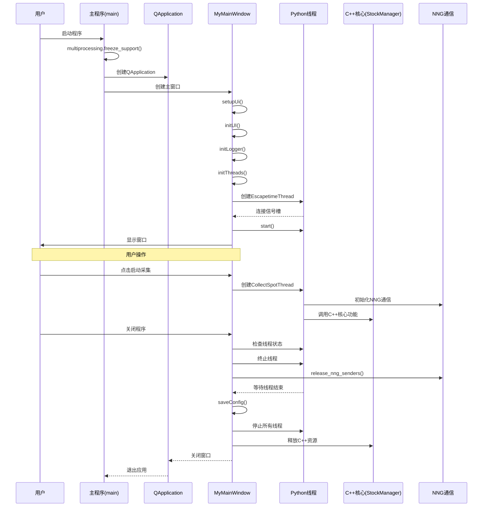
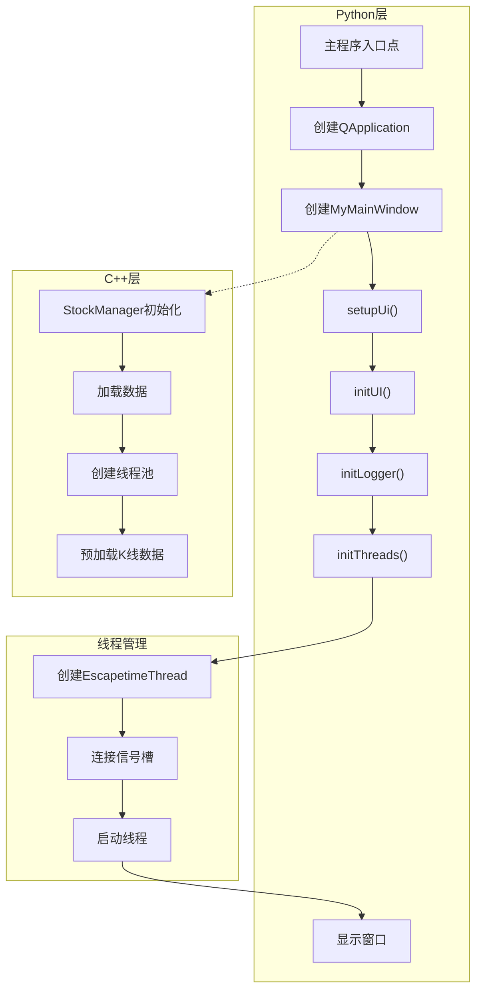
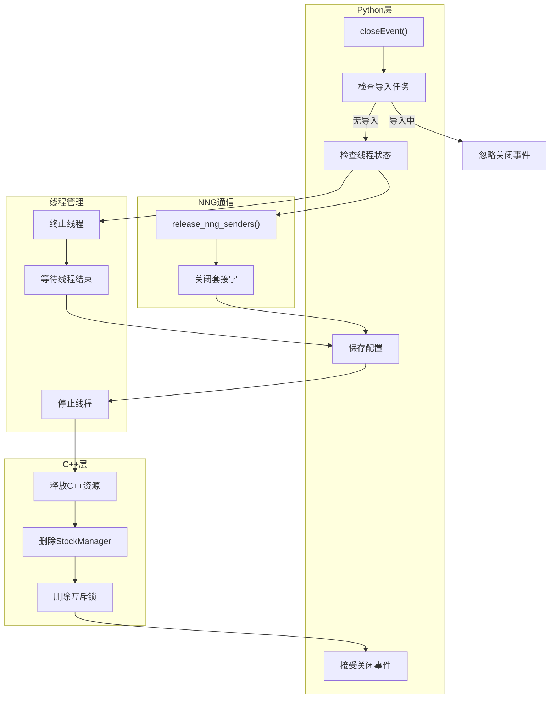
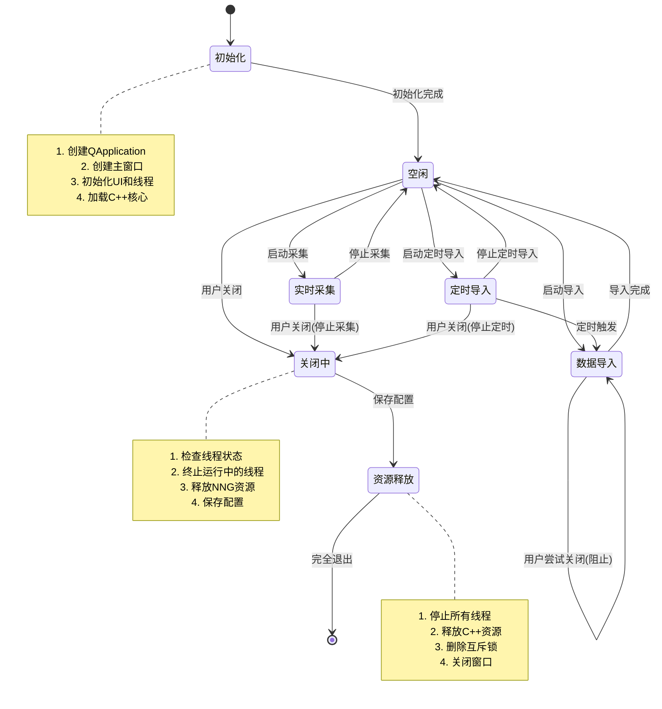

# C++内存管理与线程同步机制分析

## Hikyuu量化框架在macOS上的崩溃问题分析

Hikyuu量化框架在macOS上运行时出现崩溃，但在使用lldb调试器启动时却不崩溃。错误信息显示：

```
/opt/homebrew/Caskroom/miniconda/base/envs/quant13/lib/python3.13/multiprocessing/resource_tracker.py:277: UserWarning: resource_tracker: There appear to be 1 leaked semaphore objects to clean up at shutdown: {'/mp-o2g_aplc'}
```

以下是对可能导致崩溃的原因分析：

## 1. 多进程与信号量泄漏

错误信息指向Python多进程模块创建的信号量资源没有被正确清理。在macOS上，这个问题尤为严重：

- macOS对资源管理比Windows更严格
- macOS中的信号量是系统级资源，数量有限
- Python多进程模块在不同平台上的实现有差异

代码中使用了Python的`multiprocessing`模块创建多个进程，但可能没有正确清理资源：

```python
# 从UseTdxImportToH5Thread.py
self.process_list.clear()
for task in self.tasks:
    p = Process(target=task)
    self.process_list.append(p)
    p.start()
```

## 2. NNG (nanomsg next generation) 资源管理

代码使用pynng（NNG的Python绑定）进行进程间通信：

```python
# 从spot_server.py
g_nng_ipc_sender = pynng.Pub0()
g_nng_ipc_sender.listen(g_ipc_addr)
```

在macOS上NNG可能存在的问题：

- 应用程序终止时NNG套接字没有正确清理
- `release_nng_senders()`函数中可能存在竞态条件
- IPC地址格式（`ipc:///tmp/hikyuu_real.ipc`）在macOS上可能存在权限问题

## 3. 线程同步问题

代码使用了多种线程方式：

- PyQt5的QThread用于GUI相关线程
- Python的原生threading模块
- Python的multiprocessing模块

潜在问题：

- 错误情况下没有正确释放锁
- 线程之间的死锁
- 线程终止过程中的竞态条件

例如，在`spot_server.py`中的锁使用：

```python
def release_nng_senders():
    global g_nng_ipc_sender, g_nng_tcp_sender
    g_nng_sender_lock.acquire()
    if g_nng_ipc_sender is not None:
        g_nng_ipc_sender.close()
        g_nng_ipc_sender = None
    if g_nng_tcp_sender is not None:
        g_nng_tcp_sender.close()
        g_nng_tcp_sender = None
    g_nng_sender_lock.release()
    hku_info("release pynng socket")
```

如果在`close()`过程中发生异常，锁可能不会被释放。

## 4. ImportTdxToH5Task中的进程管理

`ImportTdxToH5Task`类创建多个进程，可能没有被正确终止：

```python
# 从UseTdxImportToH5Thread.py
self.process_list.clear()
for task in self.tasks:
    p = Process(target=task)
    self.process_list.append(p)
    p.start()
```

`__del__`中的清理可能不够充分：

```python
def __del__(self):
    for p in self.process_list:
        if p.is_alive():
            p.terminate()
```

## 5. 信号处理差异

macOS和Linux处理信号的方式与Windows不同。崩溃可能与应用程序关闭过程中信号的处理方式有关。

## 为什么在lldb下不崩溃

使用lldb（调试器）运行时，有几个因素发生变化：

1. **信号处理**：lldb在信号到达应用程序之前拦截它们
2. **时序**：调试器减慢执行速度，可能避免了竞态条件
3. **环境**：调试器提供更受控的环境
4. **资源跟踪**：某些资源泄漏可能被不同方式处理

## 修复建议

1. **修复信号量泄漏**：
   - 确保所有多进程资源都被正确清理
   - 使用`with`语句或上下文管理器管理信号量
   - 在`atexit`处理程序中实现适当的清理

2. **改进NNG资源管理**：
   - 确保在关闭过程中始终调用`release_nng_senders()`
   - 在NNG套接字使用周围添加try/finally块
   - 考虑为macOS使用平台特定的IPC路径

3. **增强线程同步**：
   - 使用线程安全队列进行线程间通信
   - 在关闭过程中实现正确的线程连接
   - 为锁获取添加超时以防止死锁

4. **改进进程管理**：
   - 确保子进程被正确终止
   - 使用进程池而不是创建单独的进程
   - 实现适当的信号处理以实现优雅关闭

5. **平台特定代码**：
   - 为macOS添加平台特定的代码路径
   - 如果NNG在macOS上有问题，使用不同的IPC机制
   - 考虑在macOS上使用不同的多进程启动方法（使用`spawn`而不是`fork`）

最可能的原因是多进程信号量泄漏和NNG套接字清理问题的组合，由于不同的资源管理方法，这些问题在macOS上比Windows上更为严重。

## Hikyuu C++代码中的锁与线程分析

### 一、主要锁保护的资源

#### 1. StockManager中的共享锁（std::shared_mutex）

StockManager是Hikyuu的核心单例类，使用了多个共享锁来保护不同的资源：

```cpp
m_stockDict_mutex = new std::shared_mutex;        // 保护股票字典
m_marketInfoDict_mutex = new std::shared_mutex;   // 保护市场信息字典
m_stockTypeInfo_mutex = new std::shared_mutex;    // 保护股票类型信息
m_holidays_mutex = new std::shared_mutex;         // 保护节假日信息
```

这些锁使用共享锁（读写锁）机制，允许多个读操作同时进行，但写操作需要独占访问，提高了并发性能。

#### 2. SpotAgent中的互斥锁（std::mutex）

SpotAgent用于接收实时行情数据，使用互斥锁保护处理函数列表：

```cpp
std::mutex m_mutex;  // 保护处理函数列表
list<std::function<void(const SpotRecord&)>> m_processList;  // 已注册的spot处理函数列表
list<std::function<void(Datetime)>> m_postProcessList;  // 已注册的批次后处理函数列表
```

这个锁确保在添加、清除处理函数时的线程安全。

#### 3. 线程池中的锁

Hikyuu实现了多种线程池，每种都使用锁来保护共享资源：

- **ThreadPool**：基本线程池，使用互斥锁和条件变量管理任务队列
- **StealThreadPool**：工作窃取线程池，使用锁保护任务队列
- **MQThreadPool**：多队列线程池
- **MQStealThreadPool**：多队列工作窃取线程池

例如，在ThreadSafeQueue中：
```cpp
mutable std::mutex m_mutex;        // 保护队列数据
std::condition_variable m_cond;    // 用于线程通知
```

#### 4. ResourcePool中的锁

ResourcePool用于管理和复用资源（如数据库连接），使用锁确保资源分配的线程安全：

```cpp
std::mutex m_mutex;               // 保护资源池
std::condition_variable m_cond;   // 用于等待资源可用
```

#### 5. TimerManager中的锁

TimerManager管理定时任务，使用锁保护定时器列表：

```cpp
std::mutex m_mutex;              // 保护定时器列表
std::condition_variable m_cond;  // 用于线程通知
```

### 二、主要线程结构

#### 1. 数据加载线程

StockManager中使用线程池和独立线程进行数据加载：

```cpp
// 异步并行加载K线数据
std::thread t = std::thread([this, ktypes, low_ktypes]() {
    this->m_load_tg = std::make_unique<ThreadPool>();
    // 加载各种K线数据...
});
```

这个线程负责并行加载大量K线数据，是系统初始化的关键部分。

#### 2. SpotAgent中的数据接收线程

SpotAgent使用独立线程接收实时行情数据：

```cpp
m_receiveThread = std::thread([this]() { work_thread(); });
```

work_thread函数通过NNG（nanomsg next generation）库接收网络数据，这可能是macOS崩溃的关键点之一。

#### 3. 线程池工作线程

各种线程池中的工作线程：

```cpp
// 在ThreadPool中创建工作线程
m_threads.push_back(std::thread(&ThreadPool::worker_thread, this, i));
```

这些线程负责执行各种任务，如数据处理、指标计算等。

#### 4. 定时器检测线程

TimerManager中的检测线程：

```cpp
m_detect_thread = std::thread([this]() { detectThread(); });
```

负责检查定时任务是否到期并执行。

### 三、进程间通信

Hikyuu使用NNG库进行进程间通信，主要用于实时行情数据的传输：

```cpp
// 在spot_server.py中
g_nng_ipc_sender = pynng.Pub0()
g_nng_ipc_sender.listen(g_ipc_addr)  // ipc:///tmp/hikyuu_real.ipc

// 在SpotAgent.cpp中
nng_socket sock;
int rv = nng_sub0_open(&sock);
rv = nng_socket_set(sock, NNG_OPT_SUB_SUBSCRIBE, ms_spotTopic, ms_spotTopicLength);
rv = nng_dial(sock, ms_pubUrl.c_str(), nullptr, 0);
```

这种IPC机制在macOS上可能存在特殊问题，尤其是在资源清理方面。

### 四、潜在问题分析

1. **NNG资源清理不完整**：
   - macOS上NNG套接字可能需要特殊处理
   - `nng_close`调用可能在异常情况下被跳过

2. **共享锁的生命周期管理**：
   - StockManager中的锁是手动管理的（使用new/delete）
   - 在程序异常退出时可能没有正确释放

3. **线程终止处理**：
   - 某些线程可能没有正确join或detach
   - 特别是SpotAgent中的接收线程

4. **进程间通信问题**：
   - IPC路径（`/tmp/hikyuu_real.ipc`）在macOS上可能有权限问题
   - 信号量资源在macOS上的限制更严格

5. **线程池资源释放**：
   - 线程池的停止和资源释放机制可能在macOS上不够健壮
   - 特别是在程序异常退出时

### 五、macOS特有的问题

1. **信号量限制**：
   - macOS对系统级信号量有更严格的限制
   - Python多进程模块在macOS上的实现与Windows不同

2. **文件描述符泄漏**：
   - NNG套接字底层使用文件描述符
   - macOS对文件描述符的管理更严格

3. **IPC路径问题**：
   - `/tmp`目录在macOS上可能有不同的权限和行为
   - 可能需要使用用户特定的临时目录

4. **线程模型差异**：
   - macOS的线程实现基于pthread
   - 可能需要不同的线程属性设置

## C++内存管理与线程同步最佳实践

### 内存管理

1. **RAII原则**（资源获取即初始化）
   - 使用智能指针（`std::unique_ptr`, `std::shared_ptr`）管理动态内存
   - 避免裸指针和手动内存管理
   - 使用容器类而不是手动分配数组

2. **避免内存泄漏**
   - 确保所有资源都有明确的所有权
   - 使用内存泄漏检测工具（如Valgrind）
   - 实现适当的析构函数清理资源

3. **避免悬空指针**
   - 使用弱引用（`std::weak_ptr`）避免循环引用
   - 确保对象销毁后不再访问

### 线程同步

1. **互斥锁与条件变量**
   - 使用`std::mutex`保护共享资源
   - 使用`std::condition_variable`进行线程通知
   - 使用`std::lock_guard`或`std::unique_lock`自动管理锁

2. **避免死锁**
   - 始终以相同顺序获取多个锁
   - 使用`std::lock`或`std::scoped_lock`同时锁定多个互斥锁
   - 设置锁超时以检测死锁

3. **原子操作**
   - 使用`std::atomic`进行简单的线程安全操作
   - 避免使用低级同步原语

4. **线程池**
   - 重用线程而不是频繁创建和销毁
   - 控制并发线程数量
   - 实现优雅的关闭机制

### 跨平台注意事项

1. **平台差异**
   - 不同操作系统的线程模型有差异
   - 信号处理在POSIX系统和Windows上不同
   - 资源限制因平台而异

2. **IPC机制**
   - 共享内存在不同平台上的实现不同
   - 命名管道和套接字的行为可能不同
   - 信号量和互斥锁的系统级实现有差异

3. **调试技巧**
   - 使用线程和内存分析工具
   - 实现详细的日志记录
   - 在调试构建中添加断言检查

## Hikyuu TDX系统初始化和结束流程分析

通过分析Hikyuu TDX系统的代码，我们可以清晰地了解其初始化和结束的流程，这对于理解可能的崩溃原因至关重要。以下是相关流程的图表分析。

### 初始化和结束时序图



### 系统初始化泳道图



### 系统结束泳道图



### 系统状态图



### 初始化和结束流程中的关键点

1. **初始化流程**:
   - Python层首先创建QApplication和主窗口
   - 主窗口初始化UI和各种线程(EscapetimeThread等)
   - 根据用户操作，可能创建数据采集线程(CollectSpotThread)
   - C++层通过StockManager单例管理所有核心资源
   - 数据加载通过线程池并行处理

2. **结束流程**:
   - 用户关闭窗口触发closeEvent
   - 检查是否有导入任务运行，如有则阻止关闭
   - 按顺序终止并等待各种线程结束
   - 释放NNG通信资源(release_nng_senders)
   - 保存配置文件
   - 停止所有线程并释放C++资源

3. **潜在问题点**:
   - 线程终止顺序可能导致资源访问冲突
   - NNG资源释放在macOS上可能不完整
   - 多进程资源(如信号量)可能未被正确清理
   - C++层的StockManager析构过程中可能存在问题
   - 异常情况下的资源释放路径可能不完整

这些流程图清晰地展示了Hikyuu TDX系统的初始化和结束过程，有助于定位可能的崩溃原因，特别是在macOS环境下。
